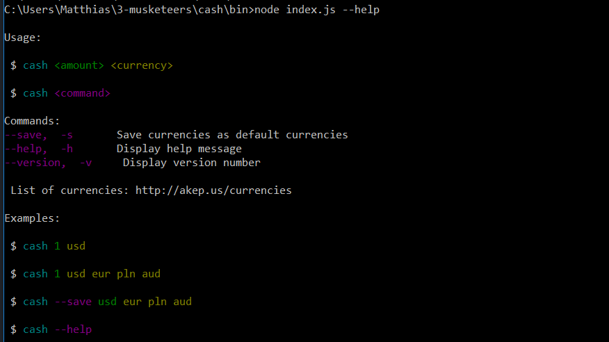
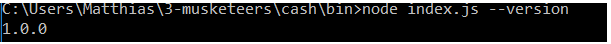
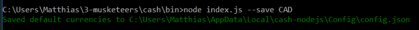
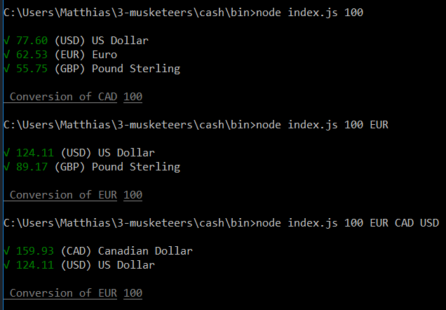

# Cash library

**Table of Contents**

- [Introduction](#introduction)
- [Fonctioning of the library](#fonctioning-of-the-library)
  - [Display the help](#display-the-help)
  - [Display the library Version](#display-the-library-version)
  - [Convert an amount](#convert-an-amount)
- [Exemple of use](#exemple-of-use)

## Introduction

The library Cash is a simple Javascript library that converts values from one currency to anothers. The library use the following API `https://api.fixer.io/latest` to get all currencies exchange values compared to euro (EUR) currency in real-time.
There is 32 currencies that you can use, go to the API link to see them.

## Fonctioning of the library

Firstly, before the first use of the library you need to run `npm install` to install all the packages needed.
Then, you can use the library.

There is several ways to use the library :

### Display the help

If you want help or more informations about the use of the library in node.js just run `node index.js` or `node index.js --help` or `node index.js -h` and you will have informations about the usages, the available currencies or several examples of use.

### Display the library Version

If you want to display the library version run the following command `node index.js --version` or `node index.js -v`.

### Convert an amount

The `node index.js` command can take three arguments wich are `amount`, `from` and `to`. You need to specify at least the amount argument.

* The `amount` is the value that you want to convert.

* The `from` argument is the currency from which you want to convert the amount. This argument is optional, if you don't want to specify it the library will use the USD currency as default. But if you want to change the default currency you can run the following command `node index.js --save currency` or `node index.js -s currency` and replace 'currency' by the currency code (USD, EUR, etc...).

* The `to` argument is the currency to which you want to convert the amount. This argument is optional too, if you don't specify it the library will use four default currencies (USD, EUR, GBP and PLN) to convert the amount and will show you the result for these four currencies. If you specify this argument you must put at least one currency but you can put several currencies (you will see that in the examples).

## Exemple of use

Here you will find several examples of use for the cash library.

* Example of showing the help

* Example of showing the version

* Example of how to save a currency as default

* Example of use

The first command just specify the amount and the library use the defaults currencies.
The second command specify the amount and the currency and the library convert the amount from this currency to the defaults currencies.
The third command specify the amount and several currencies and the library convert the amount from the first currency specified to the others currencies specified.
